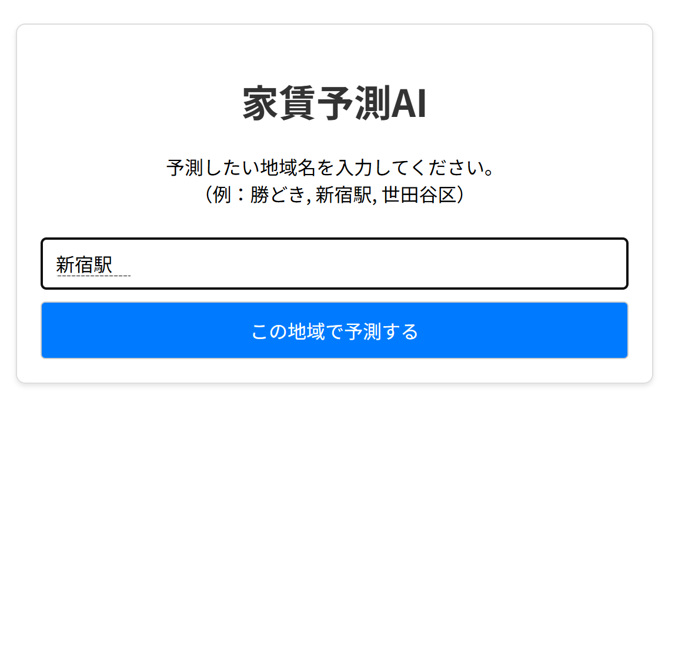
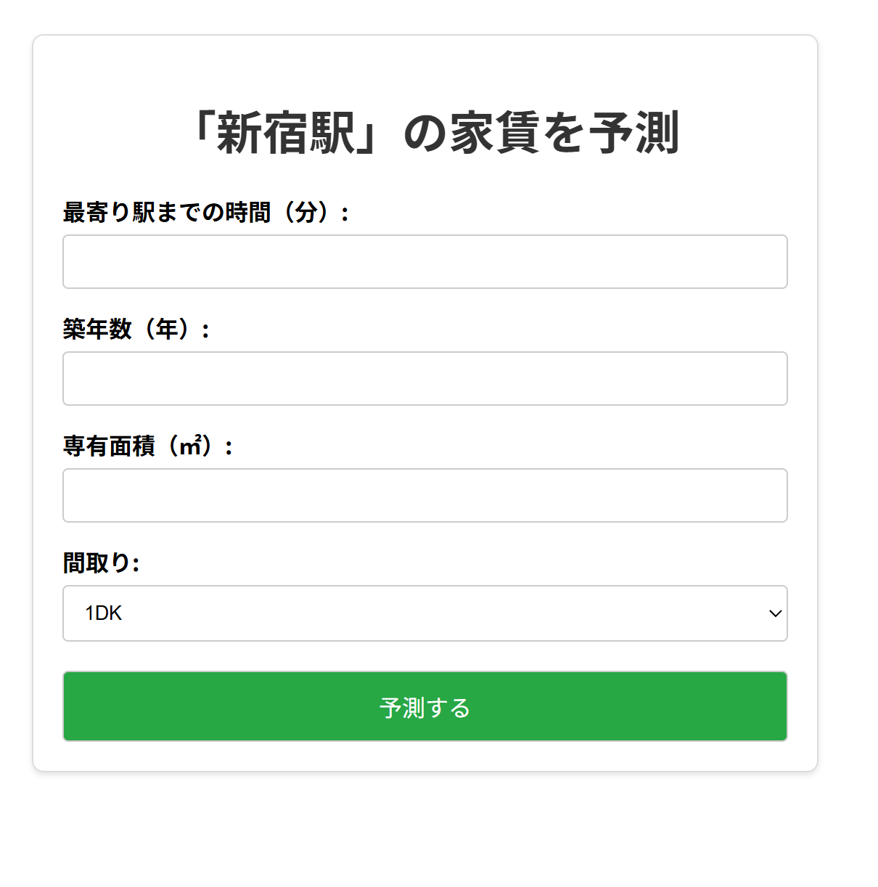

# 家賃予測AI

## 概要

このアプリケーションは、指定された地域の物件情報を自動で収集し、機械学習モデルを構築して家賃を予測するWebアプリケーションです。ユーザーは地域名と指定された情報を入力するだけで、その地域の家賃相場に基づいた予測を手軽に行うことができます。

## 特徴

* **自動データ収集**: SUUMOから指定された地域の物件情報をスクレイピングします。
* **機械学習モデル**:収集したデータを用いて、家賃を予測するためのニューラルネットワークモデルを自動で学習・保存します。
* **Webインターフェース**: Flaskを利用しており、ブラウザ上で簡単かつ直感的に操作できます。
* **モデルの再利用**: 一度学習させたモデルは保存され、次回からは学習済みのモデルを再利用して高速に予測ができます。

## 技術スタック
* **言語**: Python
* **フレームワーク**: Flask, scikit-learn
* **ライブラリ**: pandas, selenium, webdriver-manager, joblib,numpy
* **使用した外部APIやツール**: SUUMO (スクレイピング対象)

## 動作要件

このアプリケーションを実行するには、以下のライブラリが必要です。

* Flask
* pandas
* selenium
* webdriver-manager
* scikit-learn
* joblib
* numpy

以下のコマンドで、必要なライブラリを一度にインストールできます。

```bash
pip install -r requirements.txt
```
## 使用方法

1.  **リポジトリのクローン**:
    ```bash
    git clone <https://github.com/GAT252/renting_prediction>
    cd renting_prediction
    ```

2.  **依存ライブラリのインストール**:
    ```bash
    pip install -r requirements.txt
    ```

3.  **アプリケーションの起動**:
    ```bash
    python app.py
    ```

4.  **ブラウザでアクセス**:
    Webブラウザを開き、 `http://127.0.0.1:5000` にアクセスします。

5.  **地域の選択とモデルの学習**:
    * 表示されたページで、家賃を予測したい地域名（例：「新宿駅」）を入力し、「この地域で予測する」ボタンをクリックします。
    * その地域の学習済みモデルが存在しない場合、自動的にスクレイピングと学習が開始されます。完了まで数分かかることがあります。


6.  **予測情報の入力**:
    * モデルの準備が完了すると、予測情報の入力フォームに遷移します。
    * 「最寄り駅までの時間」「築年数」「専有面積」「間取り」を入力し、「予測する」ボタンをクリックします。

7.  **予測結果の確認**:
    * 入力した情報に基づいて計算された予測家賃が、結果ページに表示されます。

## ファイルとフォルダの説明

* app.py                  # Flaskアプリケーションのメインファイル
* scraper.py              # SUUMOからデータを収集し、モデルを学習・保存するスクリプト
* requirements.txt        # 必要なPythonライブラリの一覧
* .gitignore              # Gitの追跡から除外するファイル（モデルやキャッシュ）
* models/                 # 学習済みモデルやカラム情報が保存されるディレクトリ
* templates/              # HTMLテンプレート
* select_region.html  # 地域名を入力する最初のページ
* index.html          # 予測情報を入力するページ
* result.html         # 予測結果を表示するページ